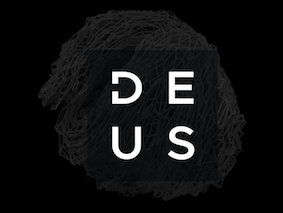

<!-- TABLE OF CONTENTS -->
<details>
  <summary>Table of Contents</summary>
  <ol>
    <li>
      <a href="#about-the-project">About The Project</a>
      <ul>
      </ul>
    </li>
    <li>
      <a href="#getting-started">Getting Started</a>
      <ul>
        <li><a href="#prerequisites">Prerequisites</a></li>
        <li><a href="#installation">Installation</a></li>
      </ul>
    </li>
    <li><a href="#usage">Usage</a></li>
    <li><a href="#roadmap">Roadmap</a></li>
    <li><a href="#contact">Contact</a></li>
    <li><a href="#acknowledgments">Running Scripts</a></li>
  </ol>
</details>


<!-- ABOUT THE PROJECT -->
## About The Project
Project owner [https://www.deus.ai/](https://www.deus.ai/)

Get a project url at [https://www.booking.com/](https://www.booking.com/)

Founded in 1996 in Amsterdam, Booking.com has grown from a small Dutch startup to one of the world’s leading digital travel companies. Part of Booking Holdings Inc. (NASDAQ: BKNG), Booking.com’s mission is to make it easier for everyone to experience the world.

By investing in the technology that helps take the friction out of travel, Booking.com seamlessly connects millions of travellers with memorable experiences, a range of transport options and incredible places to stay - from homes to hotels and much more. As one of the world’s largest travel marketplaces for both established brands and entrepreneurs of all sizes, Booking.com enables properties all over the world to reach a global audience and grow their businesses.

Booking.com is available in 43 languages and offers more than 28 million total reported accommodation listings, including over 6.6 million listings alone of homes, apartments and other unique places to stay. No matter where you want to go or what you want to do, Booking.com makes it easy and backs it all up with 24/7 customer support.


<p align="right">(<a href="#readme-top">back to top</a>)</p>


<!-- GETTING STARTED -->
## Getting Started

I created cucumber designed a Behavior Driven Development (BDD) automation 
framework (Cucumber) from scratch and also I used for project building tool Maven.
Practiced review and critique acceptance criteria. Experienced in creating 
BDD (Gherkin)feature files. Execute functional, automation,  testing for web applications.
Also I added @smok and @regression tag for running seperate features files
. Also I added @mustafa tag fr running own test scripts
### Prerequisites

I heve created  maven dependencies from this web side and added to pom.xml file
* Maven Dependencies
  ```sh
  https://mvnrepository.com/
  ```

### Installation
Clone the repo
   ```sh
   git clone https://github.com/mustafaduyarer/Deus_Project.git
   ```

<p align="right">(<a href="#readme-top">back to top</a>)</p>


<!-- USAGE EXAMPLES -->
## Usage

Use this space to show useful examples of how a cucumber project can be used. Additional screenshots, code examples and demos work well in this space. You may also link to more resources.

_For more examples, please refer to the [Documentation](https://cucumber.io/)_

<p align="right">(<a href="#readme-top">back to top</a>)</p>


<!-- ROADMAP -->
## Roadmap

- [ ] Deus Project
- [ ] src
   - [ ]  java
- [ ] Pages
  - [ ]  Page1
- [ ] runners
- [ ] Step Definitions
    - [ ]  StepDef1
- [ ] Feateres
    - [ ]  Feature1


    


<!-- CONTACT -->
## Contact

Mustafa Duyarer - [@linkedn](www.linkedin.com/in/mustafa-duyarer) - mustafaduyarer@gmail.com

Project Link: [https://github.com/mustafaduyarer/Deus_Project.git](https://github.com/mustafaduyarer/Deus_Project.git)

<p align="right">(<a href="#readme-top">back to top</a>)</p>


<!-- Running  -->
## Running Scripts
When you run the project you can use following steps

* [You can run from runner class with using any @tag]()
* [Also you can run from feature class ]()
* [If you want to take report you run the project from maven]()

<p align="right">(<a href="#readme-top">back to top</a>)</p>


